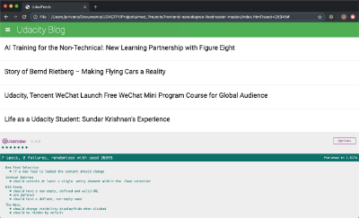

# RSS Feed Reader (Jasmine Testing)

In this project we were given a web-based application that reads RSS feeds. Then our task was to complete the testing suite using the testing framework [Jasmine](http://jasmine.github.io/).

## How to run the application

Simply download or clone the folder RSS_FeedReader and then open the file index.html in any web browser. (During the development of this project the code was tested using the following web browsers: Google Chrome, Safari, Firefox and Chromium)

## Tests Implemented

We completed, coding and running, successfully the following tests using the testing framework [Jasmine](http://jasmine.github.io/).

1. Test suite RSS Feeds.
    - Test that loops through each feed in the allFeeds object and ensures it has a URL defined and that the URL is not empty.
    - test that loops through each feed in the allFeeds object and ensures it has a name defined and that the name is not empty.
2. Test suite The menu.
    - Test that ensures the menu element is hidden by default.
    - Test that ensures the menu changes visibility when the menu icon is clicked.
3. Test suite Initial Entries.
    - Test that ensures that when the loadFeed function is called and completes its work, there is at least a single .entry element within the .feed container.
4. Test suite New Feed Selection.
    - Test that ensures that when a new feed is loaded by the loadFeed function, the content actually changes.
